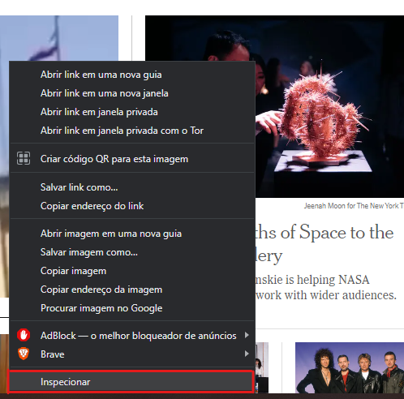
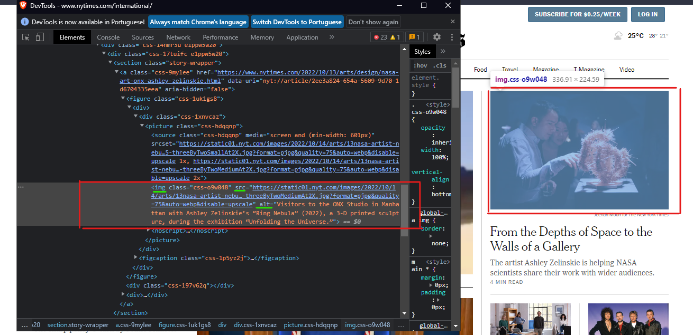
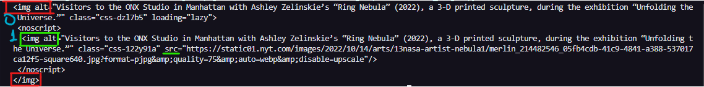
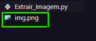

# Extraindo Imagens

O objetivo desse tutorial é ensinar o método de **extração** e **download** de imagens em sites. O script em Python não será utilizando spiders, mas simples [requisições HTTP](https://developer.mozilla.org/pt-BR/docs/Web/HTTP/Messages#:~:text=Requisi%C3%A7%C3%B5es%20HTTP%20s%C3%A3o%20mensagens%20enviadas,a%20a%C3%A7%C3%A3o%20a%20ser%20executada.).

---
## Encontrando a imagem desejada:

- Abrir o site de escolha, clicar com o botão direito do mouse na imagem desejada e selecionar a opção "Inspecionar":  

      

- Enconte a tag (img, nesse caso) correspondente à imagem marcada e os melhores parâmetros para trabalhar na extração:  

      

---

## Mãos à obra! O script...

- Primeiro, caso não tenha os módulos, instale-os  (alguns já são nativos do python dependendo da sua versão):
  
~~~Shell
pip install bs4
pip install requests
pip install urllib
~~~

 

- Insira os módulos no seu código Python:

~~~Python
import requests
import urllib.request
from bs4 import BeautifulSoup
~~~

 

- Estabeleça uma conexão com o site desejado e puxe o conteúdo dele:
  
~~~Python
response = requests.get('https://www.nytimes.com/international/') 
# Site base.

content = response.content
# Extrair o conteúdo do site.
~~~

 

- Em seguida, você deve fazer o [parser](https://pt.wikipedia.org/wiki/An%C3%A1lise_sint%C3%A1tica_(computa%C3%A7%C3%A3o)) da requisição HTTP para o HTML estruturado com o BeautifulSoup:
  
~~~Python
site_html = BeautifulSoup(content, 'html.parser')
# parser = analisa uma sequência que foi dada entrada para verificar sua estrutura gramatical segundo uma determinada gramática formal (REQUISICAO HTTP -> HTML ESTRUTURADO).
~~~

 

- Agora, é necessário encontrar aquela tag que você procurou na etapa de inspecionar:
  - Tente: 
    ~~~Python
    img = site_html.find('img', attrs={'alt':'Visitors to the ONX Studio in Manhattan with Ashley Zelinskie’s “Ring Nebula” (2022), a 3-D printed sculpture, during the exhibition “Unfolding the Universe.”'})

    link = img.attrs['src']
    ~~~

    1. Caso dê erro, pode ser porque algum parâmetro foi escrito errado. Nesse caso, você pode tentar usar outro atributo da tag ou verificar todas as estruturas daquele tipo:

        ~~~Python
        img = site_html.find('img', attrs={'alt':'Visitors to the ONX Studio in Manhattan with Ashley Zelinskie’s “Ring Nebula” (2022), a 3-D printed sculpture, during the exhibition “Unfolding the Universe.”'})

        print(img.prettify())
        ~~~
         

          

    2. Então use:
        ~~~Python
        img = site_html.findAll('img', attrs={'alt':'Visitors to the ONX Studio in Manhattan with Ashley Zelinskie’s “Ring Nebula” (2022), a 3-D printed sculpture, during the exhibition “Unfolding the Universe.”'})
        # Pela estrutura do site, sabe-se que há duas tags de imagem com o mesmo alt, mas somente a segunda contém o src com o link de imagem. Assim, deve-se extrair ambas e selecionar a que contém o src.

        link = img[1].attrs['src']
        # Puxa o atributo src encontrado na segunda tag.
        ~~~
          

- Passo final: baixar a imagem.

~~~Python
urllib.request.urlretrieve(f'{link}', 'img.png')
# Faz o download com base no link dado. O segundo parametro indica o nome do arquivo gerado.
~~~

 

  

---

## License
- Licensed under the [GPL 3.0](https://www.gnu.org/licenses/gpl-3.0.pt-br.html)
