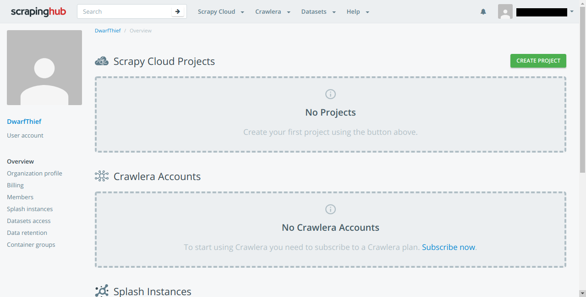
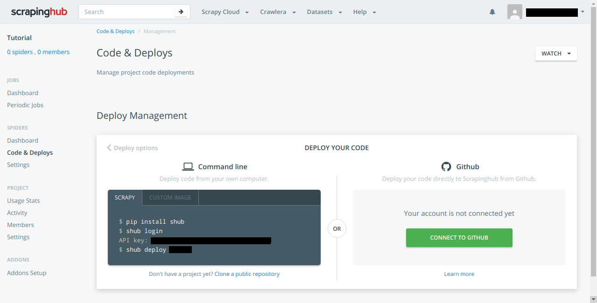
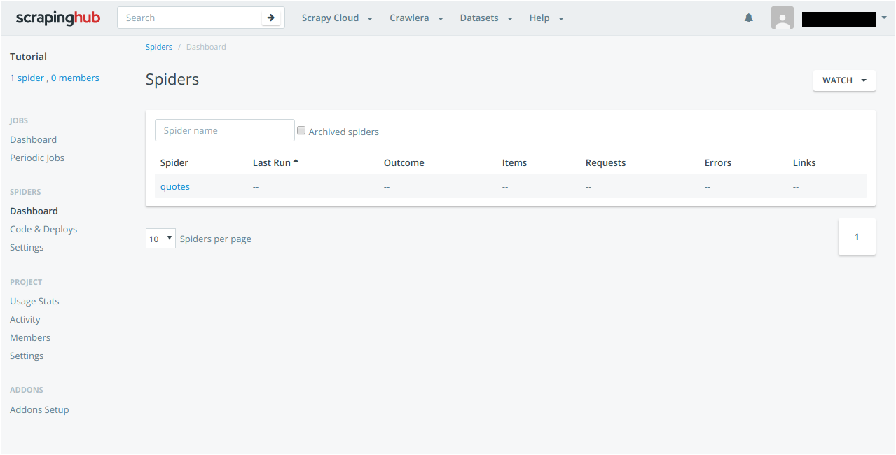
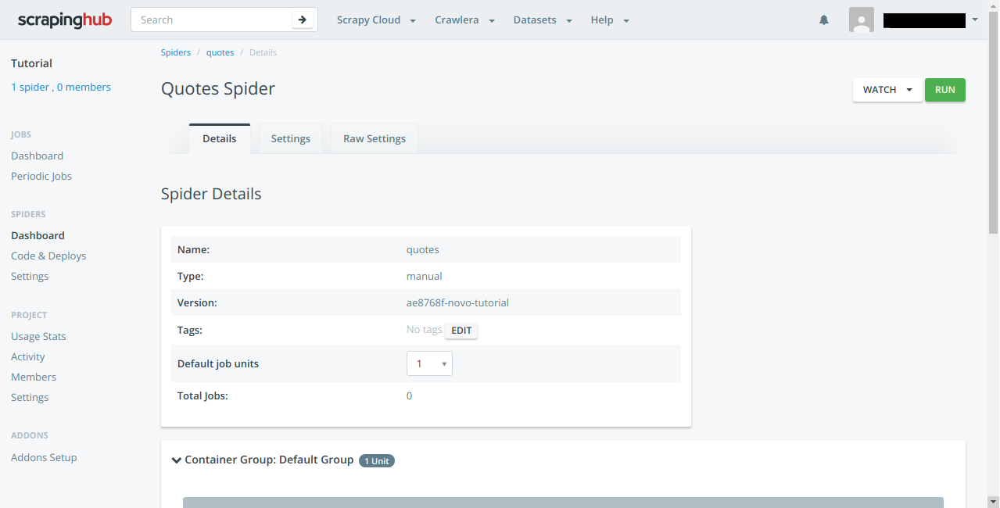
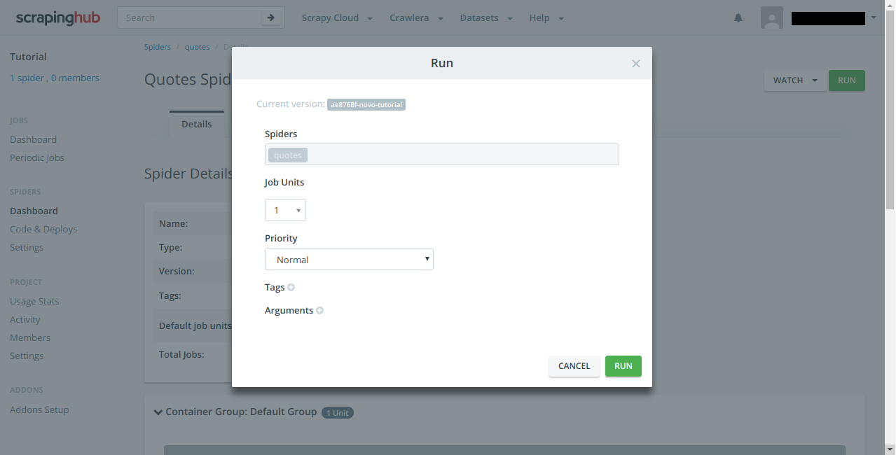
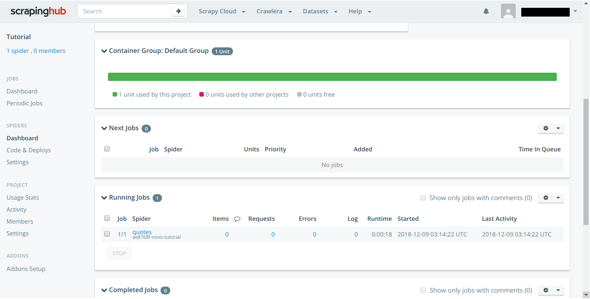
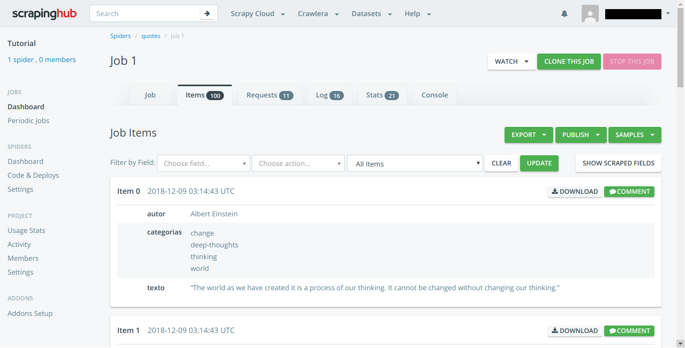

# Rodando Spider na nuvem


Agora que já sabemos bastante sobre Raspagem de dados, vamos automatizar mais ainda o processo e vamos rodar a Spider na nuvem.
* Para esse tutorial vamos precisar instalar shub.
```
pip install shub
```
* Tambem vamos precisar criar uma conta no [site](https://scrapinghub.com) onde iremos hospedar nossa Spider.
## Criando o nosso projeto
Vamos criar um projeto onde terão todos os dados necessários.
```
scrapy startproject Cloud
```
Agora vamos editar nossa spider, acesse a pasta `/Cloud/Spiders`, acesse o arquivo `__init__.py`, essa será nossa spider, eu estarei usando o código do tutorial [Navegando entre paginas](https://github.com/DwarfThief/Raspagem-de-dados-para-iniciantes/blob/master/Tutoriais/Navegando%20entre%20paginas.ipynb). Após alterar o arquivo e salvar, é hora de testar se a Spider esta funcionando como o planejado.

Dessa vez será um pouco diferente, vamos usar o comando `crawl` e passando como parâmetro o nome dado para a Spider que criamos.

```
scrapy crawl quotes
```

## Configurando o app

Agora que já testamos nossa Spider e o projeto, ta na hora de configurar o app para nossa Spider.

### 1. Essa é a primeira página que veremos, crie um novo projeto:



### 2. Teremos que importar nossa Spider para a nuvem.

* Vamos ter que realizar o login no `shub login`, será solicitado a API Key, cobri o meu por razões de segurança.
* Agora vamos dar o `shub deploy <numero-do-projeto>` para enviar nossa spider para o servidor (o número do projeto tambem se encontra na página).



### 3. Vamos acessar a lista das nossas Spiders, é aqui que ficam as Spiders que importamos.


### 4. Ao clicar na Spider teremos acesso as informações dela.


### 5. Vamos rodar a Spider clicando em `Run`.
* Aqui podemos categorizar e descrever a atividade realizada pela Spider.


### 6. Esse é o painel onde podemos ver todas as Spiders em ação, no nosso caso, apenas uma.


### 7. Ao finalizar, poderemos ter acesso ao log de eventos da Spider, assim como a quantidade de resquests e claro... aos dados que ela foi capaz de minerar.
